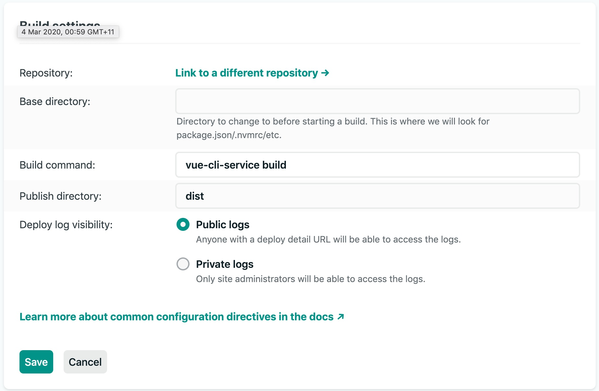
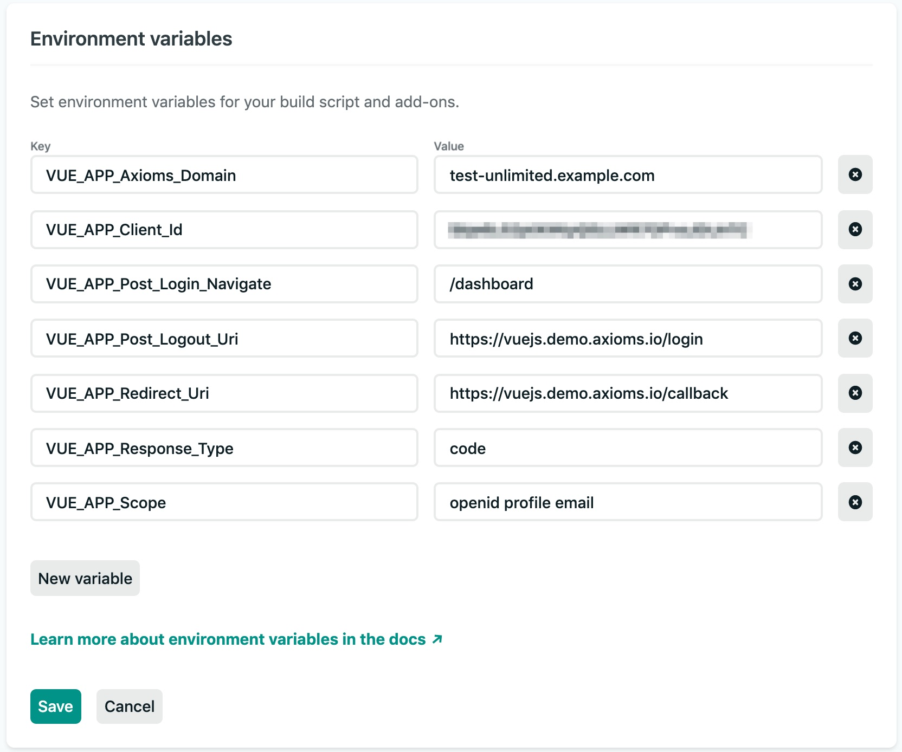

# sample-vuejs
Vue.js sample with [Axioms](https://axioms.io) authentication using `web-js` SDK.


## Clone or download this repo
```
git clone git@github.com:axioms-io/sample-vuejs.git
cd sample
```

Make sure to update the origin.

```
git remote set-url origin new.git.url/here
```

## Install dependencies
```
npm install
```

## Update config
Either update `.env.prod` or create a `.env.local` to add following configs. If you are using Netlify for deployment and build you can use their environment variables (see Netlify details at the end).

- `Your-App-Domain` is where you going to host or run your app. It can be `localhost` or a domain
- `Your_Client_ID` is your client id which can be obtained from the Axioms Dashboard -> Clients section
- `<Your_Slug>.axioms.io` is your Axioms tenant default domain or custom domain mapped to Axioms servers

```
VUE_APP_Client_Id=<Your_Client_ID>
VUE_APP_Axioms_Domain=<Your_Slug>.axioms.io
VUE_APP_Redirect_Uri=https://<Your-App-Domain>/callback
VUE_APP_Post_Logout_Uri=https://<Your-App-Domain>/login
VUE_APP_Response_Type=code
VUE_APP_Scope=openid profile
```

We recommend to use `code` response type (Authorization code flow with PKCE). For more supported response type options please review  `web-js` documentation.

### Compile and hot-reload for local development
```
npm run serve
```

### Compile and minify for production

Build using `.env.prod`

```
vue-cli-service build --mode --mode prod
```


## Build and deploy to Netlify

1. Simply fork this repository and connect your Github project in Netlify.

2. Configure your build command and output directory and you are good to go.


### Build Settings
Build command: `yarn build` or `npm build`

Publish directory: `build/`



### Environment Settings
